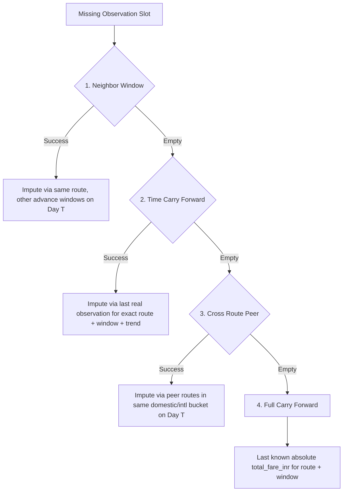

# FlyWise (APIx) — Edge Cases & Operational Resilience

This document specifies the technical and statistical handling of real-world aviation market edge cases in the FlyWise data collection and index pipeline.

---

## 1. Diverted Flights & Operational Disruptions

### The Challenge
Severe weather, technical snags, and airspace congestion cause flights to be delayed, cancelled, or diverted on the scheduled date of departure. In conventional datasets, analysts often wonder whether historical airfare records should be retroactively deleted or adjusted when a flight does not operate as planned.

### FlyWise Architecture & Handling
- **Separation of Quoted Price from Delivery Event**:
  In accordance with international CPI standards (ILO CPI Manual, §6.42), consumer price indices measure transaction and quotation prices established at the time of purchase, not post-purchase service fulfillment.
- **Informational Tracking via `flight_events`**:
  The ingestion layer captures disruptions in a dedicated `flight_events` table (`processing/index_engine.py::_log_flight_events`):
  ```sql
  SELECT flight_number, operational_status, logged_at 
  FROM flight_events 
  WHERE travel_date = %s AND operational_status != 'completed';
  ```
- **Engine Invariance**:
  Disruption logs are rendered as contextual overlays on the analyst dashboard. They are **never** used to retroactively alter, reweight, or delete observation fares recorded during earlier collection cycles. If a consumer paid ₹6,500 at T+21 for a flight that is cancelled on day of departure, ₹6,500 was the economic price signal on that collection date.

---

## 2. Partner Substitution & Airline Alliances

### The Challenge
Airlines frequently sell tickets under their own marketing brand that are operated by alliance partners or regional subsidiaries (e.g., an Air India ticket on `DEL-BOM` operated by Air India Express equipment, or an Emirates booking operated by flydubai). Comparing an Air India full-service booking against a low-cost subsidiary product without normalization distorts price indices.

### FlyWise Architecture & Handling
- **Operating vs. Marketing Carrier Ingestion**:
  The unified observation schema explicitly captures both `airline` (marketing carrier) and `operating_carrier` (`ingestion/normalize_fare_family.py`):
  ```json
  {
    "airline": "AI",
    "airline_name": "Air India",
    "operating_carrier": "IX",
    "flight_number": "AI-9999"
  }
  ```
- **Service Spec Normalization**:
  The flight's cabin rules, baggage allowance, and fare family tier are mapped to the actual equipment operator's baggage policy rather than the marketing shell.

---

## 3. Imputation Hierarchy (Deterministic 4-Tier Cascade)

### The Challenge
Web scrapers, OTA rate limits, and network dropouts inevitably cause missing cells in daily collection cycles. Uncontrolled data gaps would cause route indices to drop out, introducing artificial step-function jumps in national aggregates.

### FlyWise Architecture & Handling
Implemented in `processing/imputation.py`, FlyWise enforces a deterministic 4-tier fallback cascade. When an expected `(route_id, advance_days)` slot is missing from the daily run, the engine executes the following priority order (first success wins):



1. **`neighbor_window`**: Multiplies the baseline price by the average price-relative movement observed across other lead-time windows of the *same route* on the *same day*.
2. **`time_carry_forward`**: Uses the most recent real observation for this *exact route and window*, updated by the route's trailing trend.
3. **`cross_route`**: Multiplies the baseline price by the average price-relative movement of all other routes in the same sector (domestic or international) on day $t$.
4. **`full_carry_forward`**: Retains the last known absolute fare for this exact route and window without adjustment.

**Auditing & Transparency**:
- Every imputed row is tagged with `is_imputed = TRUE` and `imputation_method = 'neighbor_window' | 'time_carry_forward' | 'cross_route' | 'full_carry_forward'`.
- The engine computes a daily **`coverage_score`**:
  $$\text{coverage\_score} = \frac{\text{Count of non-imputed expected observations}}{\text{Total count of expected observations}}$$
- If `coverage_score < 0.80`, the dashboard triggers visual telemetry alerts and logs degraded confidence.

---

## 4. Session Contamination & Dynamic Pricing Bias

### The Challenge
Airline yield management engines employ client-side behavioral tracking (cookies, session IDs, recurring IP fingerprints) to identify consumers repeatedly searching for the same route, artificially inflating fares shown to that session (dynamic price discrimination).

### FlyWise Architecture & Handling
- **Ephemeral Browser Contexts**:
  In `collectors/ota_scraper.py`, every search execution initializes an isolated Playwright browser context:
  ```python
  context = await browser.new_context(
      user_agent=USER_AGENT,
      viewport={"width": 1280, "height": 800},
      locale="en-IN",
      timezone_id="Asia/Kolkata",
  )
  # Zero cookie persistence across requests
  ```
- **Complete Session Sanitation**:
  Cookies, IndexedDB, local storage, and session caches are disposed immediately after each query.
- **Direct SERP Anti-Fingerprinting**:
  In `collectors/bright_data_adapter.py`, the SERP API proxy executes raw HTTP fetches that do not reuse client headers or user profiles across route queries.

---

## 5. Codeshare Deduplication

### The Challenge
On major trunk corridors, a single physical flight is routinely co-marketed under 2 to 4 flight numbers (e.g., IndiGo marketing a Turkish Airlines flight, or Air India co-listing an Air India Express flight). Counting both records would assign double statistical weight to that aircraft, biasing the Jevons geometric mean.

### FlyWise Architecture & Handling
Implemented in `ingestion/dedup_observations.py`:
- **Deduplication Key**:
  Observations within each batch are keyed on:
  $$\text{Dedup Key} = (\text{route\_id},\; \text{travel\_date},\; \text{operating\_carrier},\; \text{rounded\_hour})$$
- **Timestamp Hour Binning**:
  Scrape timestamps are rounded to the nearest hour using `round_timestamp_to_nearest_hour()`.
- **Resolution Strategy**:
  When two records share the same operating carrier, route, travel date, and departure window, the pipeline identifies them as a codeshare pair, retains the observation with the **lowest consumer price**, and discards the marketing duplicate:
  ```python
  if new_fare is not None and (existing_fare is None or float(new_fare) < float(existing_fare)):
      seen[key] = obs
  ```

---

## 6. Glitch Fares & Component Reconciliation

### The Challenge
OTA parsing failures, transient database synchronization bugs, and airline tariff upload errors occasionally produce absurd price anomalies (e.g., a ₹350 fare on Delhi–Mumbai where typical taxes alone exceed ₹1,000, or negative component breakdowns).

### FlyWise Architecture & Handling
Implemented in `processing/quality_fx_engine.py`:
- **Glitch Fare Detection**:
  The engine checks every fare against the route's trailing 7-day median:
  $$\text{total\_fare\_inr} < 0.20 \times \text{trailing\_7\_day\_median}$$
  Observations violating this threshold are flagged in the `validation_flags` table with `flag_type = 'suspected_glitch_fare'` and excluded from index calculation.
- **Fare Component Reconciliation**:
  For all detailed fare observations, the component sum is validated within a $\pm 1\%$ tolerance:
  $$\left| \frac{(\text{base\_fare} + \text{taxes} + \text{fees}) - \text{total\_fare}}{\text{total\_fare}} \right| \le 0.01$$
  Mismatches are flagged as `reconciliation_failed`, lowering the observation's composite quality score.

---

## 7. Flight Renumbering & Schedule Changes

### The Challenge
Airlines renumber flights at the start of IATA scheduling seasons (Summer schedule in late March, Winter schedule in late October), or alter numbers on alternate weekdays (e.g., 6E-205 on weekdays, 6E-2115 on Sundays). If an index engine tracks price relatives by flight number, every seasonal schedule change triggers mass missing data.

### FlyWise Architecture & Handling
- **Decoupling from Flight Numbers**:
  FlyWise elementary cells are defined strictly by product specification (`service_spec_id`), not by flight number:
  $$\text{DEL-BOM-economy-nonstop-T21-15kg-standard}$$
- **Time-Slot Invariance**:
  Whether IndiGo operates flight 6E-205 or renumbers it to 6E-2115, as long as it operates as a nonstop economy flight with standard baggage at lead-time T+21 on DEL-BOM, it maps directly to the identical specification cell.

---

## 8. Seasonal Routes

### The Challenge
Tourism-dependent corridors operate only during specific seasons:
- **`DEL-GOI` (Delhi–Goa)**: High frequency in winter (Oct–Mar), sharp schedule reductions in monsoon (Jun–Sep).
- **`DEL-SXR` (Delhi–Srinagar)**: High frequency in spring/summer (Apr–Oct), reduced frequency in winter.
Treating seasonal routes as missing in their off-season would falsely depress national coverage scores and trigger unnecessary imputation.

### FlyWise Architecture & Handling
- **Seasonal Registry in `config/routes_config.json`**:
  ```json
  {
    "route_id": "DEL-GOI",
    "origin": "DEL",
    "destination": "GOI",
    "currency": "INR",
    "season_window": "Oct-Mar",
    "windows": [1, 7, 15, 21, 30, 45]
  }
  ```
- **Calendar Parsing (`_is_in_season`)**:
  `processing/index_engine.py` and `processing/imputation.py` parse month boundaries:
  ```python
  def _is_in_season(season_window: Optional[str], check_date: date) -> bool:
      # Evaluates whether check_date.month is within the specified boundary
  ```
- **Coverage Score Protection**:
  When a seasonal route is outside its active window, the collection slot is marked out-of-season:
  1. It is excluded from the denominator of `expected_slots`.
  2. No synthetic imputation rows are generated.
  3. The route's absence does not reduce `national_index.coverage_score`.
  4. When the route re-enters season, its base reference price reactivates cleanly.
